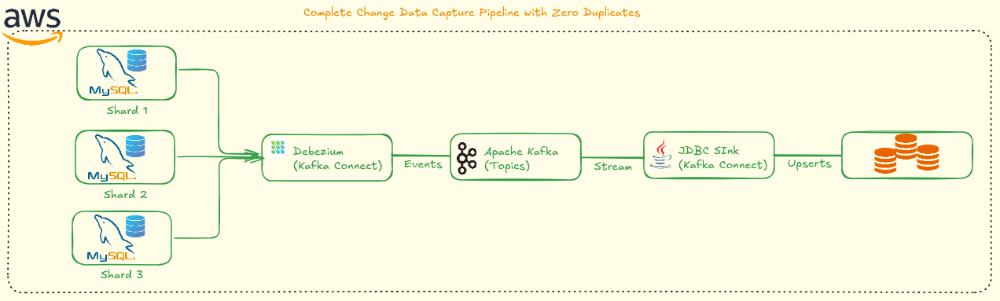

<div align="center">
  


## Complete Change Data Capture Pipeline with Zero Duplicates

**Updated: January 2, 2026**

[](https://github.com/nicoleepaixao)
[](https://github.com/nicoleepaixao/mysql-cdc-kafka-debezium)
[](https://nicoleepaixao.medium.com/replicação-cdc-de-mysql-para-mysql-usando-kafka-debezium-da-frustração-à-solução-de6d2fb2a3eb)

</div>

---

<p align="center">
  
</p>

## **Overview**

This project implements an automated MySQL Change Data Capture (CDC) replication pipeline using Kafka and Debezium. The solution addresses a critical challenge: ensuring CDC replication captures only new records after database backup restoration without duplicating existing data. The entire setup runs locally via Docker Compose, enabling rapid validation and testing of CDC configurations.

---

## **The Problem**

When restoring a MySQL database from a backup, CDC replication must:

| **Requirement** | **Challenge** |
|-----------------|---------------|
| **Capture new records only** | Avoid reprocessing historical data already in backup |
| **Prevent duplicates** | Ensure destination doesn't receive duplicate inserts |
| **Synchronize from backup point** | Start CDC from exact backup timestamp |
| **Validate automatically** | Manual validation is time-consuming and error-prone |

### **Real-World Scenario**

```text
Production Database Backup (3 records) → Restore to Target
    ↓
New transactions occur (2 records)
    ↓
CDC must capture ONLY these 2 new records
    ↓
Target should have: 3 (backup) + 2 (new) = 5 records total
```

### **Why This Matters**

- **Data Integrity**: Prevents duplicate records in destination database
- **Resource Efficiency**: Avoids unnecessary data processing and storage
- **Operational Confidence**: Automated validation reduces human error
- **Development Speed**: Local testing enables rapid iteration
- **Production Readiness**: Validates CDC behavior before production deployment

---

## **Architecture**

### **CDC Pipeline Flow**

<p align="center">
  
</p>

</div>

---

## **How It Works**

### **Validation Flow**

The project automates a complete CDC validation scenario:

| **Stage** | **Source Records** | **Target Records** | **Status** |
|-----------|-------------------|-------------------|------------|
| **1. Initial State** | 3 | 3 | Both databases identical (post-backup) |
| **2. Backlog Insert** | 5 | 3 | 2 new records only in source |
| **3. CDC Activation** | 5 | 5 | Connectors replicate missing records |
| **4. Real-time Test** | 6 | 6 | New insert propagates immediately |

### **Key Components**

| **Component** | **Purpose** | **Configuration** |
|---------------|-------------|-------------------|
| **MySQL Source** | Production-like database with binlog | Port 3307, binlog_format=ROW |
| **MySQL Target** | Simulates restored backup destination | Port 3308, standard config |
| **Apache Kafka** | Event streaming platform | Single broker, topic auto-creation |
| **Zookeeper** | Kafka cluster coordination | Required for Kafka 2.x |
| **Debezium Source** | Captures MySQL binlog changes | Snapshot mode: initial |
| **Debezium Sink** | Writes changes to target database | Insert mode: upsert |

### **CDC Capture Strategy**

```text
Debezium Source Connector Behavior:
├── snapshot.mode: initial
│   ├── Takes initial snapshot of existing data
│   ├── Publishes snapshot to Kafka topic
│   └── Then switches to binlog streaming
├── Binlog Position Tracking
│   ├── Stores position in Kafka topic
│   ├── Resumes from last position on restart
│   └── Ensures exactly-once delivery
└── Schema Evolution
    ├── Captures DDL changes
    ├── Stores in schema history topic
    └── Enables sink to adapt automatically
```

---

## **Project Structure**

```text
mysql-cdc-kafka-debezium/
│
├── README.md                          # Complete documentation
│
├── docker-compose.yml                 # Infrastructure orchestration
│   ├── mysql-source (3307)
│   ├── mysql-target (3308)
│   ├── zookeeper (2181)
│   ├── kafka (9092)
│   └── kafka-connect (8083)
│
├── connect-plugins/                   # Connector dependencies
│   └── mysql-connector-j-8.0.33.jar  # JDBC driver for sink
│
├── dumps/                            # Shared volume for backups
│
└── scripts/                          # Automation scripts
    ├── 01-setup-databases.sh         # Create tables and users
    ├── 02-insert-initial-data.sh     # Insert 3 baseline records
    ├── 03-insert-backlog.sh          # Insert 2 additional records
    ├── 04-create-source-connector.sh # Configure Debezium source
    ├── 05-create-sink-connector.sh   # Configure Debezium sink
    └── 06-validate-sync.sh           # Verify record counts
```

---

## **Quick Start**

### **Prerequisites**

| **Requirement** | **Version** | **Purpose** |
|-----------------|-------------|-------------|
| Docker | 20.10+ | Container runtime |
| Docker Compose | 2.0+ | Multi-container orchestration |
| curl | Any | REST API interaction |
| 8GB RAM | Minimum | Run all services locally |

### **1. Clone Repository**

```bash
git clone https://github.com/nicoleepaixao/mysql-cdc-kafka-debezium.git
cd mysql-cdc-kafka-debezium
```

### **2. Download JDBC Driver (Optional)**

```bash
mkdir -p connect-plugins
curl -L -o connect-plugins/mysql-connector-j-8.0.33.jar \
  https://repo1.maven.org/maven2/com/mysql/mysql-connector-j/8.0.33/mysql-connector-j-8.0.33.jar
```

**Note:** Required only for Confluent JDBC Sink tests. Debezium JDBC Sink has driver built-in.

### **3. Start Infrastructure**

```bash
# Launch all services
docker-compose up -d

# Verify service health (wait ~30 seconds)
docker-compose ps

# Expected output: All services "Up" or "healthy"
```

### **4. Setup Databases and Permissions**

```bash
# Create source table
docker exec -it mysql-source mysql -uroot -prootpass1234 -e "
CREATE TABLE source.nicole_paixao (
  id INT AUTO_INCREMENT PRIMARY KEY,
  seller_id INT NOT NULL,
  score DECIMAL(10,2) NOT NULL,
  score_date DATE NOT NULL,
  created_at TIMESTAMP DEFAULT CURRENT_TIMESTAMP,
  updated_at TIMESTAMP DEFAULT CURRENT_TIMESTAMP ON UPDATE CURRENT_TIMESTAMP
);
"

# Create target table
docker exec -it mysql-target mysql -uroot -ptargetroot1234 -e "
CREATE TABLE targetdb.nicole_paixao (
  id INT AUTO_INCREMENT PRIMARY KEY,
  seller_id INT NOT NULL,
  score DECIMAL(10,2) NOT NULL,
  score_date DATE NOT NULL,
  created_at TIMESTAMP DEFAULT CURRENT_TIMESTAMP,
  updated_at TIMESTAMP DEFAULT CURRENT_TIMESTAMP ON UPDATE CURRENT_TIMESTAMP
);
"

# Grant CDC permissions (source)
docker exec -it mysql-source mysql -uroot -prootpass1234 -e "
GRANT SELECT, RELOAD, SHOW DATABASES, REPLICATION SLAVE, REPLICATION CLIENT 
ON *.* TO 'read_user'@'%';
FLUSH PRIVILEGES;
"

# Grant write permissions (target)
docker exec -it mysql-target mysql -uroot -ptargetroot1234 -e "
GRANT ALL PRIVILEGES ON targetdb.* TO 'dbadmin'@'%';
FLUSH PRIVILEGES;
"
```

### **5. Insert Initial Dataset**

```bash
# Insert 3 records in source (simulates production data)
docker exec -it mysql-source mysql -uroot -prootpass1234 -e "
INSERT INTO source.nicole_paixao (seller_id, score, score_date)
VALUES
  (11111, 80.50, '2025-01-01'),
  (22222, 90.00, '2025-01-02'),
  (33333, 75.25, '2025-01-03');
"

# Insert same 3 records in target (simulates backup restore)
docker exec -it mysql-target mysql -uroot -ptargetroot1234 -e "
INSERT INTO targetdb.nicole_paixao (seller_id, score, score_date)
VALUES
  (11111, 80.50, '2025-01-01'),
  (22222, 90.00, '2025-01-02'),
  (33333, 75.25, '2025-01-03');
"

# Verify initial state
docker exec -it mysql-source mysql -uroot -prootpass1234 -e "
SELECT COUNT(*) AS source_count FROM source.nicole_paixao;"

docker exec -it mysql-target mysql -uroot -ptargetroot1234 -e "
SELECT COUNT(*) AS target_count FROM targetdb.nicole_paixao;"
```

**Expected result:** Both databases have 3 records ✅

### **6. Create Backlog (New Transactions)**

```bash
# Insert 2 additional records ONLY in source
docker exec -it mysql-source mysql -uroot -prootpass1234 -e "
INSERT INTO source.nicole_paixao (seller_id, score, score_date)
VALUES
  (44444, 88.80, '2025-02-01'),
  (55555, 77.77, '2025-02-02');
"

# Verify pre-CDC state
docker exec -it mysql-source mysql -uroot -prootpass1234 -e "
SELECT COUNT(*) AS source_count FROM source.nicole_paixao;"
# Output: 5 records

docker exec -it mysql-target mysql -uroot -ptargetroot1234 -e "
SELECT COUNT(*) AS target_count FROM targetdb.nicole_paixao;"
# Output: 3 records (unchanged)
```

**Expected state:** Source = 5, Target = 3 ✅

### **7. Activate CDC Source Connector**

```bash
curl -X POST http://localhost:8083/connectors \
  -H "Content-Type: application/json" \
  -d '{
    "name": "mysql-source-nicole-paixao-v3",
    "config": {
      "connector.class": "io.debezium.connector.mysql.MySqlConnector",
      "database.hostname": "mysql-source",
      "database.port": "3306",
      "database.user": "read_user",
      "database.password": "readpass1234",
      "database.server.id": "888",
      "topic.prefix": "localtest",
      "database.include.list": "source",
      "table.include.list": "source.nicole_paixao",
      "snapshot.mode": "initial",
      "include.schema.changes": "false",
      "database.allowPublicKeyRetrieval": "true",
      "schema.history.internal.kafka.bootstrap.servers": "kafka:9092",
      "schema.history.internal.kafka.topic": "schema-changes.nicole_paixao_v3",
      "key.converter": "org.apache.kafka.connect.json.JsonConverter",
      "key.converter.schemas.enable": "true",
      "value.converter": "org.apache.kafka.connect.json.JsonConverter",
      "value.converter.schemas.enable": "true"
    }
  }'

# Verify connector status
curl http://localhost:8083/connectors/mysql-source-nicole-paixao-v3/status | jq
```

**Expected output:** `"state": "RUNNING"` ✅

### **8. Activate CDC Sink Connector**

```bash
curl -X POST http://localhost:8083/connectors \
  -H "Content-Type: application/json" \
  -d '{
    "name": "jdbc-sink-nicole-paixao",
    "config": {
      "connector.class": "io.debezium.connector.jdbc.JdbcSinkConnector",
      "tasks.max": "1",
      "topics": "localtest.source.nicole_paixao",
      "connection.url": "jdbc:mysql://mysql-target:3306/targetdb?useSSL=false&allowPublicKeyRetrieval=true",
      "connection.username": "dbadmin",
      "connection.password": "targetpass1234",
      "database.type": "mysql",
      "insert.mode": "upsert",
      "delete.enabled": "true",
      "primary.key.mode": "record_key",
      "primary.key.fields": "id",
      "schema.evolution": "basic",
      "table.name.format": "nicole_paixao"
    }
  }'

# Verify connector status
curl http://localhost:8083/connectors/jdbc-sink-nicole-paixao/status | jq
```

**Expected output:** `"state": "RUNNING"` ✅

### **9. Validate Synchronization**

```bash
# Wait 5-10 seconds for CDC processing
sleep 10

# Check target record count
docker exec -it mysql-target mysql -uroot -ptargetroot1234 -e "
SELECT COUNT(*) AS total_records FROM targetdb.nicole_paixao;
"
# Expected: 5 records

# View all records to verify no duplicates
docker exec -it mysql-target mysql -uroot -ptargetroot1234 -e "
SELECT id, seller_id, score, score_date 
FROM targetdb.nicole_paixao 
ORDER BY id;
"
```

**Expected result:** 5 unique records (3 initial + 2 backlog), no duplicates ✅

### **10. Test Real-Time Replication**

```bash
# Insert new record in source
docker exec -it mysql-source mysql -uroot -prootpass1234 -e "
INSERT INTO source.nicole_paixao (seller_id, score, score_date)
VALUES (66666, 99.99, '2025-03-10');
"

# Verify immediate propagation (wait 2-3 seconds)
sleep 3

docker exec -it mysql-target mysql -uroot -ptargetroot1234 -e "
SELECT COUNT(*) AS total_records FROM targetdb.nicole_paixao;
"
# Expected: 6 records

# View latest record
docker exec -it mysql-target mysql -uroot -ptargetroot1234 -e "
SELECT * FROM targetdb.nicole_paixao WHERE seller_id = 66666;
"
```

**Expected result:** New record appears in target within seconds ✅

---

## **Understanding the Results**

### **Validation Timeline**

| **Stage** | **Source Count** | **Target Count** | **Delta** | **Status** |
|-----------|-----------------|-----------------|-----------|------------|
| Initial setup | 3 | 3 | 0 | ⚠️ Pre-sync baseline |
| After backlog insert | 5 | 3 | 2 | ⚠️ Replication needed |
| After CDC activation | 5 | 5 | 0 | ✅ Synchronized |
| After real-time insert | 6 | 6 | 0 | ✅ Streaming active |

### **Expected Data in Target**

```sql
-- Query results after CDC synchronization
mysql> SELECT * FROM targetdb.nicole_paixao ORDER BY id;
+----+-----------+-------+------------+---------------------+---------------------+
| id | seller_id | score | score_date | created_at          | updated_at          |
+----+-----------+-------+------------+---------------------+---------------------+
|  1 |     11111 | 80.50 | 2025-01-01 | 2025-01-02 10:00:00 | 2025-01-02 10:00:00 |
|  2 |     22222 | 90.00 | 2025-01-02 | 2025-01-02 10:00:00 | 2025-01-02 10:00:00 |
|  3 |     33333 | 75.25 | 2025-01-03 | 2025-01-02 10:00:00 | 2025-01-02 10:00:00 |
|  4 |     44444 | 88.80 | 2025-02-01 | 2025-01-02 10:05:00 | 2025-01-02 10:05:00 |
|  5 |     55555 | 77.77 | 2025-02-02 | 2025-01-02 10:05:00 | 2025-01-02 10:05:00 |
+----+-----------+-------+------------+---------------------+---------------------+
5 rows in set (0.00 sec)
```

### **Verification Checklist**

- ✅ No duplicate records (verify `id` uniqueness)
- ✅ All 5 records present (3 initial + 2 backlog)
- ✅ Timestamps preserved correctly
- ✅ Primary keys sequential (1-5)
- ✅ Data values match source exactly

---

## **Common Issues & Solutions**

### **Issue 1: Schema History Topic Missing**

**Symptoms:**
```text
ERROR: The db history topic is missing. 
You may attempt to recover it by reconfiguring the connector...
```

**Root Cause:** Schema history topic was deleted or became inconsistent between connector restarts.

**Solution:**
```bash
# Delete old connector
curl -X DELETE http://localhost:8083/connectors/mysql-source-nicole-paixao-v3

# Use new schema history topic name
curl -X POST http://localhost:8083/connectors \
  -H "Content-Type: application/json" \
  -d '{
    "name": "mysql-source-nicole-paixao-v4",
    "config": {
      "schema.history.internal.kafka.topic": "schema-changes.nicole_paixao_v4",
      ...
    }
  }'
```

### **Issue 2: Date Conversion Errors**

**Symptoms:**
```text
ERROR: Data truncation: Incorrect date value: '20091' for column 'score_date'
```

**Root Cause:** Confluent JDBC Sink doesn't handle Debezium's `io.debezium.time.Date` logical type.

**Solution:** Use Debezium JDBC Sink instead of Confluent:
```json
{
  "connector.class": "io.debezium.connector.jdbc.JdbcSinkConnector",
  "database.type": "mysql"
}
```

**Connector Comparison:**

| **Aspect** | **Confluent JDBC Sink** | **Debezium JDBC Sink** |
|------------|------------------------|----------------------|
| Class | `io.confluent.connect.jdbc.JdbcSinkConnector` | `io.debezium.connector.jdbc.JdbcSinkConnector` |
| Username property | `connection.user` | `connection.username` |
| Database type | Auto-detected | `database.type` required |
| Debezium types | ❌ Limited support | ✅ Full support |
| DATE conversion | ❌ Fails | ✅ Converts correctly |
| TIMESTAMP conversion | ❌ May fail | ✅ Works natively |
| Best for | Generic JDBC sources | Debezium CDC sources |

### **Issue 3: Connector Configuration Error**

**Symptoms:**
```text
ERROR: Error configuring JdbcSinkConnectorConfig
```

**Root Cause:** Missing required properties or incorrect property names.

**Solution:** Ensure all required properties are present:
```json
{
  "connector.class": "io.debezium.connector.jdbc.JdbcSinkConnector",
  "database.type": "mysql",
  "connection.username": "dbadmin",  // NOT connection.user
  "connection.password": "targetpass1234",
  "insert.mode": "upsert",
  "primary.key.mode": "record_key",
  "primary.key.fields": "id"
}
```

### **Issue 4: Duplicate Records Appearing**

**Symptoms:** Target database has more records than expected, with duplicate values.

**Root Cause:** Sink connector not configured for upsert mode or missing primary key configuration.

**Solution:**
```json
{
  "insert.mode": "upsert",              // Enables update on conflict
  "primary.key.mode": "record_key",     // Uses Kafka message key
  "primary.key.fields": "id",           // Specifies conflict column
  "delete.enabled": "true"              // Handles DELETE events
}
```

### **Issue 5: Kafka Connect API Not Responding**

**Symptoms:**
```bash
curl: (7) Failed to connect to localhost port 8083: Connection refused
```

**Root Cause:** Kafka Connect not fully started or crashed.

**Solution:**
```bash
# Check service status
docker-compose ps kafka-connect

# View logs
docker-compose logs -f kafka-connect

# Restart if needed
docker-compose restart kafka-connect

# Wait for API readiness (~30 seconds)
curl http://localhost:8083/ | jq
```

---

## **Useful Commands**

### **Connector Management**

```bash
# List all connectors
curl http://localhost:8083/connectors | jq

# Get specific connector status
curl http://localhost:8083/connectors/mysql-source-nicole-paixao-v3/status | jq

# Get connector configuration
curl http://localhost:8083/connectors/mysql-source-nicole-paixao-v3 | jq

# Delete connector
curl -X DELETE http://localhost:8083/connectors/mysql-source-nicole-paixao-v3

# Restart connector
curl -X POST http://localhost:8083/connectors/mysql-source-nicole-paixao-v3/restart

# Pause connector
curl -X PUT http://localhost:8083/connectors/mysql-source-nicole-paixao-v3/pause

# Resume connector
curl -X PUT http://localhost:8083/connectors/mysql-source-nicole-paixao-v3/resume
```

### **Kafka Topic Management**

```bash
# List all topics
docker exec -it kafka kafka-topics \
  --bootstrap-server kafka:9092 \
  --list

# Describe specific topic
docker exec -it kafka kafka-topics \
  --bootstrap-server kafka:9092 \
  --describe \
  --topic localtest.source.nicole_paixao

# Consume messages from beginning
docker exec -it kafka kafka-console-consumer \
  --bootstrap-server kafka:9092 \
  --topic localtest.source.nicole_paixao \
  --from-beginning

# Consume with key and timestamp
docker exec -it kafka kafka-console-consumer \
  --bootstrap-server kafka:9092 \
  --topic localtest.source.nicole_paixao \
  --property print.key=true \
  --property print.timestamp=true \
  --from-beginning

# Delete topic (requires cleanup)
docker exec -it kafka kafka-topics \
  --bootstrap-server kafka:9092 \
  --delete \
  --topic localtest.source.nicole_paixao
```

### **MySQL Database Operations**

```bash
# Connect to source database
docker exec -it mysql-source mysql -uroot -prootpass1234 source

# Connect to target database
docker exec -it mysql-target mysql -uroot -ptargetroot1234 targetdb

# Check binlog status (source)
docker exec -it mysql-source mysql -uroot -prootpass1234 -e "SHOW BINARY LOGS;"

# View binlog position (source)
docker exec -it mysql-source mysql -uroot -prootpass1234 -e "SHOW MASTER STATUS;"

# Count records in both databases
docker exec -it mysql-source mysql -uroot -prootpass1234 -e "
SELECT 'SOURCE' AS db, COUNT(*) AS records FROM source.nicole_paixao;"

docker exec -it mysql-target mysql -uroot -ptargetroot1234 -e "
SELECT 'TARGET' AS db, COUNT(*) AS records FROM targetdb.nicole_paixao;"
```

### **Complete Environment Reset**

```bash
# Stop all containers
docker-compose down

# Remove all volumes (WARNING: deletes all data)
docker-compose down -v

# Remove Kafka Connect plugins (optional)
rm -rf connect-plugins/*

# Restart from scratch
docker-compose up -d

# Wait for services to be ready
sleep 30
docker-compose ps
```

### **Debugging and Monitoring**

```bash
# View all service logs
docker-compose logs -f

# View specific service logs
docker-compose logs -f kafka-connect
docker-compose logs -f mysql-source

# Check container resource usage
docker stats

# Inspect connector tasks
curl http://localhost:8083/connectors/mysql-source-nicole-paixao-v3/tasks | jq

# View connector offsets
docker exec -it kafka kafka-console-consumer \
  --bootstrap-server kafka:9092 \
  --topic connect-offsets \
  --from-beginning
```

---

## **Configuration Deep Dive**

### **Debezium Source Connector Parameters**

| **Parameter** | **Value** | **Purpose** |
|---------------|-----------|-------------|
| `snapshot.mode` | `initial` | Take full snapshot then stream changes |
| `database.server.id` | `888` | Unique server ID for binlog replication |
| `topic.prefix` | `localtest` | Kafka topic naming prefix |
| `include.schema.changes` | `false` | Don't capture DDL changes |
| `key.converter` | `JsonConverter` | JSON format for message keys |
| `value.converter` | `JsonConverter` | JSON format for message values |
| `schemas.enable` | `true` | Include schema in messages |

### **Debezium Sink Connector Parameters**

| **Parameter** | **Value** | **Purpose** |
|---------------|-----------|-------------|
| `insert.mode` | `upsert` | Update on conflict, insert if new |
| `delete.enabled` | `true` | Process DELETE events from source |
| `primary.key.mode` | `record_key` | Use Kafka message key as PK |
| `schema.evolution` | `basic` | Allow column additions automatically |
| `table.name.format` | Custom | Map topic to specific table name |

### **Snapshot Mode Options**

| **Mode** | **Behavior** | **Use Case** |
|----------|-------------|-------------|
| `initial` | Full snapshot → binlog streaming | First-time setup |
| `initial_only` | Snapshot only, no streaming | One-time data migration |
| `never` | Binlog streaming only | Resume from known position |
| `when_needed` | Snapshot if no position saved | Automatic recovery |
| `schema_only` | Capture schema, skip data | Schema evolution only |

---

## **Features**

| **Feature** | **Description** |
|-------------|-----------------|
| **Zero Duplicates** | Upsert mode prevents duplicate inserts |
| **Automated Validation** | Scripts verify record counts at each stage |
| **Binlog Position Tracking** | Resumes from last position on restart |
| **Schema Evolution** | Automatically adapts to DDL changes |
| **Local Testing** | Complete CDC pipeline in Docker |
| **Real-time Replication** | Sub-second latency for new records |
| **Fault Tolerance** | Kafka stores events for replay |
| **Multi-table Support** | Easily extend to multiple tables |
| **Delete Propagation** | Handles DELETE operations correctly |
| **Update Tracking** | Captures UPDATE operations with before/after |

---

## **Technologies Used**

| **Technology** | **Version** | **Purpose** |
|----------------|-------------|-------------|
| Docker | 20.10+ | Container runtime |
| Docker Compose | 2.0+ | Multi-container orchestration |
| MySQL | 8.0 | Source and target databases |
| Apache Kafka | 2.13-3.4 | Event streaming platform |
| Debezium | 2.6 | Change Data Capture connectors |
| Kafka Connect | 2.6 | Connector runtime framework |
| Zookeeper | 3.8 | Kafka cluster coordination |

---

## **Use Cases**

| **Use Case** | **Application** |
|--------------|-----------------|
| **Database Migration** | Validate CDC before production cutover |
| **Backup Restoration** | Ensure no duplicate data after restore |
| **Disaster Recovery** | Test failover scenarios locally |
| **Multi-Region Sync** | Replicate data across regions |
| **Analytics Pipeline** | Stream database changes to data warehouse |
| **Audit Trail** | Capture all database modifications |
| **Microservices Integration** | Share data changes across services |
| **Development Testing** | Safe environment for CDC configuration |

---

## **Security Best Practices**

### **Production Considerations**

| **Aspect** | **Recommendation** |
|------------|-------------------|
| **Credentials** | Use AWS Secrets Manager or HashiCorp Vault |
| **Network** | Place Kafka in private subnet with VPC peering |
| **Encryption** | Enable SSL/TLS for Kafka and MySQL connections |
| **Access Control** | Implement RBAC for Kafka Connect API |
| **Monitoring** | Set up CloudWatch alarms for lag and failures |
| **Backup** | Configure Kafka topic retention policies |

### **MySQL User Permissions**

**Minimum required permissions for CDC:**

```sql
-- Source database user (read-only CDC)
GRANT SELECT, RELOAD, SHOW DATABASES, REPLICATION SLAVE, REPLICATION CLIENT 
ON *.* TO 'cdc_user'@'%';

-- Target database user (write access)
GRANT INSERT, UPDATE, DELETE ON targetdb.* TO 'sink_user'@'%';
```

---

## **Monitoring and Observability**

### **Key Metrics to Track**

| **Metric** | **What to Monitor** | **Alert Threshold** |
|------------|-------------------|-------------------|
| **Replication Lag** | Time between source change and target update | > 5 seconds |
| **Connector Status** | RUNNING vs FAILED state | Any FAILED state |
| **Kafka Topic Size** | Message backlog in topic | > 10,000 messages |
| **Error Rate** | Failed message processing | > 1% error rate |
| **Throughput** | Messages per second | Sudden drops |

### **Health Check Commands**

```bash
# Check connector health
curl http://localhost:8083/connectors/mysql-source-nicole-paixao-v3/status | \
  jq '.connector.state, .tasks[].state'

# Monitor Kafka consumer lag
docker exec -it kafka kafka-consumer-groups \
  --bootstrap-server kafka:9092 \
  --describe \
  --group connect-jdbc-sink-nicole-paixao

# View recent errors
docker-compose logs --tail=50 kafka-connect | grep ERROR
```

---

## **Performance Tuning**

### **Optimization Strategies**

| **Component** | **Configuration** | **Impact** |
|---------------|------------------|-----------|
| **Source Connector** | `max.batch.size: 2048` | Larger batches, fewer requests |
| **Kafka Topic** | `partitions: 3` | Parallel processing |
| **Sink Connector** | `tasks.max: 3` | Multiple writers |
| **Batch Processing** | `batch.size: 1000` | Reduce insert overhead |
| **Network** | Enable compression | Reduce bandwidth usage |

### **Sample Optimized Configuration**

```json
{
  "name": "mysql-source-optimized",
  "config": {
    "connector.class": "io.debezium.connector.mysql.MySqlConnector",
    "max.batch.size": "2048",
    "max.queue.size": "8192",
    "poll.interval.ms": "100",
    "tasks.max": "1"
  }
}
```

---

## **Troubleshooting Guide**

### **Problem: Connector Stuck in PAUSED State**

```bash
# Resume the connector
curl -X PUT http://localhost:8083/connectors/mysql-source-nicole-paixao-v3/resume

# Verify state change
curl http://localhost:8083/connectors/mysql-source-nicole-paixao-v3/status
```

### **Problem: Messages Not Appearing in Target**

```bash
# 1. Verify source connector is producing messages
docker exec -it kafka kafka-console-consumer \
  --bootstrap-server kafka:9092 \
  --topic localtest.source.nicole_paixao \
  --max-messages 5

# 2. Check sink connector logs
docker-compose logs kafka-connect | grep -i error

# 3. Verify target database connectivity
docker exec -it mysql-target mysql -udbadmin -ptargetpass1234 -e "SELECT 1"
```

### **Problem: Duplicate Records After Restart**

**Cause:** Sink connector not using upsert mode correctly.

**Solution:**
```bash
# Delete and recreate sink with proper configuration
curl -X DELETE http://localhost:8083/connectors/jdbc-sink-nicole-paixao

# Recreate with upsert mode
curl -X POST http://localhost:8083/connectors \
  -H "Content-Type: application/json" \
  -d '{
    "name": "jdbc-sink-nicole-paixao",
    "config": {
      "insert.mode": "upsert",
      "primary.key.mode": "record_key",
      "primary.key.fields": "id"
    }
  }'
```

---

## **Advanced Scenarios**

### **Filtering Specific Columns**

```json
{
  "name": "mysql-source-filtered",
  "config": {
    "column.include.list": "source.nicole_paixao.id,source.nicole_paixao.seller_id,source.nicole_paixao.score"
  }
}
```

### **Handling Schema Changes**

```sql
-- Add new column to source table
ALTER TABLE source.nicole_paixao ADD COLUMN region VARCHAR(50);

-- Debezium automatically captures DDL and updates sink
-- Verify in target
DESCRIBE targetdb.nicole_paixao;
```

### **Multi-Table Replication**

```json
{
  "name": "mysql-source-multi-table",
  "config": {
    "table.include.list": "source.nicole_paixao,source.sales_data,source.inventory"
  }
}
```

---

## **Full Article on Medium**

For a comprehensive deep-dive into the challenges faced and how every issue was resolved, read the complete story:

**[Replicação CDC de MySQL para MySQL usando Kafka + Debezium: da frustração à solução](https://nicoleepaixao.medium.com/replicação-cdc-de-mysql-para-mysql-usando-kafka-debezium-da-frustração-à-solução-de6d2fb2a3eb)**

---

## **Additional Resources**

### **Official Documentation**

- [Debezium MySQL Connector](https://debezium.io/documentation/reference/stable/connectors/mysql.html) - Complete connector reference
- [Debezium JDBC Sink](https://debezium.io/documentation/reference/stable/connectors/jdbc.html) - Sink connector guide
- [Kafka Connect](https://kafka.apache.org/documentation/#connect) - Connect framework docs
- [MySQL Binlog](https://dev.mysql.com/doc/refman/8.0/en/binary-log.html) - Binary log configuration
- [Kafka Topic Configuration](https://kafka.apache.org/documentation/#topicconfigs) - Topic tuning parameters

### **Community Resources**

- [Debezium Community](https://debezium.io/community/) - Forums and chat
- [Kafka Users Mailing List](https://kafka.apache.org/contact) - Community support
- [Stack Overflow - Debezium Tag](https://stackoverflow.com/questions/tagged/debezium) - Q&A

---

## **Future Enhancements**

| **Feature** | **Description** | **Status** |
|-------------|-----------------|------------|
| **Schema Registry** | Avro schema management | Planned |
| **ksqlDB Integration** | Stream processing capabilities | In Development |
| **Monitoring Dashboard** | Grafana dashboards for metrics | Planned |
| **Multi-Datacenter** | Cross-region replication setup | Future |
| **Terraform Automation** | Infrastructure as Code deployment | Planned |
| **AWS MSK Support** | Managed Kafka integration | Future |
| **Change Data Filtering** | Row-level replication filters | Planned |

---

## **Connect & Follow**

Stay updated with CDC best practices, Kafka streaming, and data engineering:

<div align="center">

[](https://github.com/nicoleepaixao)
[](https://www.linkedin.com/in/nicolepaixao/)
[](https://medium.com/@nicoleepaixao)

</div>

---

## **Disclaimer**

This project is for educational and testing purposes. The Docker Compose setup is designed for local development environments. CDC configurations, Kafka settings, and database parameters may need adjustment for production use. Always validate replication behavior in staging environments before deploying to production. Consult official Debezium and Apache Kafka documentation for production best practices.

---

<div align="center">

**Happy replicating your data with CDC!**

*Document last updated: January 2, 2026*

</div>